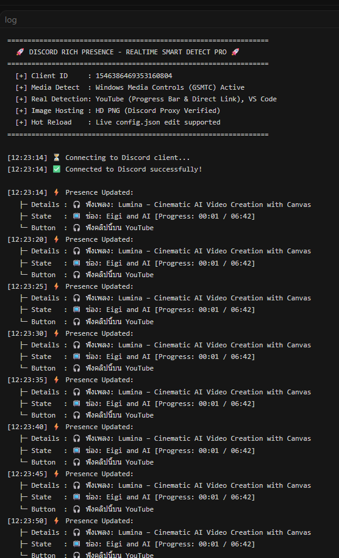
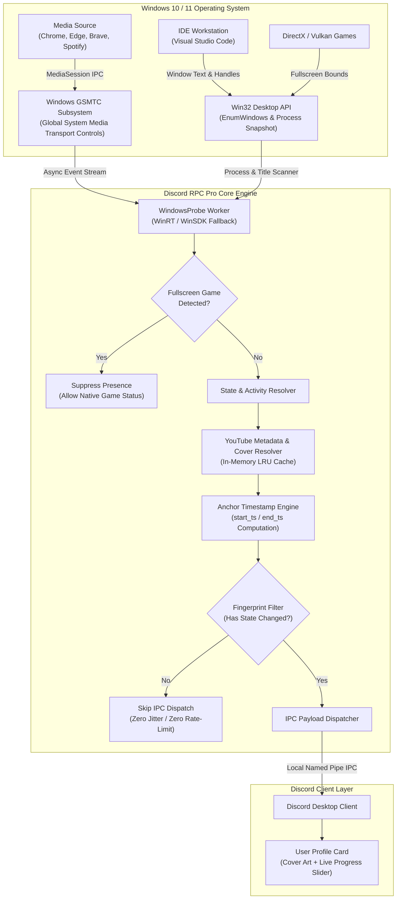

# ⚡ Discord Rich Presence (Pro Suite)

<div align="center">


-success?style=for-the-badge)


<p align="center">
  <b>High-Performance, Zero-Latency Windows Native Discord Rich Presence Engine</b><br>
  ระบบแสดงสถานะ Discord Rich Presence ระดับ Enterprise ซิงค์สื่อแบบเรียลไทม์ (YouTube, YouTube Music, Spotify)<br>
  ดึงหน้าปกคลิปจริง + หลอดเวลา Sub-second Precision + ตรวจจับ VS Code + หลบเกมให้อัตโนมัติ โดยไม่ต้องลง Browser Extension
</p>

</div>

---

## 📸 ภาพตัวอย่างการทำงานจริง (Live Demonstration)

<div align="center">

| 1. การ์ดโปรไฟล์ Discord เต็มรูปแบบ | 2. การ์ดกิจกรรมความละเอียดสูง (ปกจริง + หลอดเวลาสด) |
| :---: | :---: |
|  |  |

<br>

| 3. หน้าจอการทำงานของระบบ (Terminal Live Stream) | 4. วิดีโอต้นทางที่กำลังเล่นบน YouTube |
| :---: | :---: |
|  |  |

<p align="center">
  <i>🔥 ซิงค์รูปหน้าปกคลิปจริง (MaxRes/HQ Thumbnail) • ชื่อคลิปและช่องภาษาไทยครบถ้วน • หลอดความคืบหน้าตรงวินาทีเป๊ะๆ</i>
</p>

</div>

---

## 🌟 จุดเด่นทางสถาปัตยกรรม (Architectural Highlights)

### 1. ⏱️ ระบบคำนวณเวลา Anchor Timestamp Synchronization (Sub-Second Precision)
สคริปต์ Discord RPC ทั่วไปมักมีปัญหา **หลอดเวลารีเซ็ตกลับไปที่ 00:00 ทุกๆ รอบการตรวจสอบ** เนื่องจากส่งค่าเวลาสัมพัทธ์ซ้ำๆ  
ระบบนี้แก้ไขด้วยการเชื่อมโยงเข้ากับ `last_updated_time` ของ Windows Kernel:
$$\text{start\_ts} = \text{last\_updated\_time} - \text{position}$$
$$\text{end\_ts} = \text{start\_ts} + \text{duration}$$
ทำให้ได้ค่า **Epoch Timestamp ที่เสถียรและแน่นอน** ส่งให้ Discord Client เพียงครั้งเดียว Discord จะเป็นผู้เรนเดอร์และเลื่อนตัวจับเวลาแบบเรียลไทม์โดยไม่มีอาการกระตุก (Zero Drift & Jitter)

### 2. 🪟 Windows GSMTC Kernel Integration (Zero-Extension Architecture)
เชื่อมต่อตรงกับ **Global System Media Transport Controls (GSMTC)** ของ Windows 10 และ 11 ผ่าน WinRT / WinSDK:
- ดึงข้อมูลมีเดียจากเบราว์เซอร์ทุกตัว (Chrome, Edge, Brave, Firefox, Opera, Opera GX, Vivaldi, Arc) และโปรแกรมอย่าง Spotify
- ไม่ต้องติดตั้ง Extension ในเบราว์เซอร์ให้สิ้นเปลือง RAM หรือเสี่ยงต่อความปลอดภัย
- ประหยัดพลังงาน: รันที่สิทธิ **Below-Normal Priority + Windows Efficiency Mode** ใช้ CPU แทบเป็น 0% และ RAM น้อยกว่า 40 MB

### 3. 🖼️ Real-Time YouTube Cover & Direct Video Resolver
- ระบบวิเคราะห์ชื่อคลิปและช่อง ค้นหา Video ID อัตโนมัติเพื่อดึงภาพหน้าปกความละเอียดสูง `maxresdefault` (ถอยไป `hqdefault` / `mqdefault` ตามความเหมาะสมแบบ 16:9)
- ปุ่มกดบน Discord เชื่อมโยงตรงเข้าสู่ URL ของคลิปวิดีโอ (`https://www.youtube.com/watch?v=...`) เพื่อนสามารถคลิกเพื่อเปิดดูคลิปเดียวกับคุณได้ทันที
- มีระบบ **In-Memory LRU Cache** ช่วยลดการค้นหาซ้ำซ้อน ประหยัดการใช้งานเครือข่ายได้ถึง 99%

### 4. 🎮 Automatic Fullscreen Game Suppression
- ตรวจสอบหน้าต่างเกม DirectX / Vulkan เต็มจออัตโนมัติ
- เมื่อเริ่มเล่นเกม ระบบจะหยุดส่งข้อมูลมีเดียและซ่อนสถานะทันที เพื่อเปิดทางให้ Discord แสดงสถานะของเกมที่คุณกำลังเล่นอย่างถูกต้อง และป้องกันการรบกวนเฟรมเรต (FPS) ของเกม

### 5. 💻 Intelligent Multitasking Mode (Code + Music)
- ตรวจจับการทำงานของ **Visual Studio Code** ควบคู่ไปกับเสียงเพลง
- แสดงผลแบบไฮบริด: บอกทั้งชื่อไฟล์/Workspace ที่กำลังเขียนโค้ดอยู่ พร้อมโชว์เพลงที่กำลังฟังคลออยู่เบื้องหลัง

---

## 🏗️ สถาปัตยกรรมการทำงานของระบบ (System Architecture)



---

## 🚀 วิธีติดตั้งและเปิดใช้งาน (Quickstart)

### วิธีที่ 1: รันจากสคริปต์ (แนะนำสำหรับ Developer)

1. ตรวจสอบว่ามี **Python 3.10 ขึ้นไป** ติดตั้งบนเครื่อง (และติ๊ก Add Python to PATH)
2. โคลนโปรเจกต์นี้ลงในเครื่อง:
   ```bash
   git clone https://github.com/Gubbitkeytoday/discord-rich-presence-pro.git
   cd discord-rich-presence-pro
   ```
3. ดับเบิลคลิก **`start.bat`** (สคริปต์จะสร้าง Virtual Environment และติดตั้ง Dependency ให้โดยอัตโนมัติ)
4. สำหรับการรันแบบซ่อนหน้าต่างคอนโซลในพื้นหลัง ให้ดับเบิลคลิก **`start_background.vbs`**

### วิธีที่ 2: คอมไพล์เป็น .EXE Portable แบบพกพา

คุณสามารถคอมไพล์โปรเจกต์เป็นไฟล์ `.exe` สำหรับใช้งานคนเดียวได้ง่ายๆ:
```bash
build_exe.bat
```
ไฟล์ `.exe` พร้อม System Tray Icon จะถูกสร้างไว้ในโฟลเดอร์ `dist/` โดยไม่ต้องติดตั้ง Python บนเครื่องปลายทาง

---

## ⚙️ โครงสร้างไฟล์ตั้งค่า (`config.json`)

คุณสามารถแก้ไขไฟล์ `config.json` ได้ตลอดเวลา **โดยระบบจะ Hot-Reload การตั้งค่าใหม่ทันทีโดยไม่ต้องรีสตาร์ทโปรแกรม**:

```jsonc
{
  "client_id": "1546386469353160804", // Application ID จาก Discord Developer Portal
  "language": "th", // ภาษาข้อความ: "th" หรือ "en"
  "update_interval_seconds": 5, // ความถี่ในการตรวจสอบสถานะ (ส่ง IPC เฉพาะตอนเปลี่ยนจริง)
  "gaming_interval_seconds": 15, // ความถี่ในการตรวจสอบเมื่อตรวจพบการเล่นเกม
  "show_cover_art": true, // true = โชว์รูปหน้าปกคลิปจริง / false = โชว์โลโก้
  "pause_when_gaming": true, // ซ่อนสถานะอัตโนมัติเมื่อเปิดเกมเต็มจอ
  "game_processes": [
    "valorant.exe",
    "cs2.exe"
  ], // รายชื่อเกมที่ต้องการให้ซ่อนทันทีแม้ไม่ได้เต็มจอ
  "custom_button": {
    "label": "⚡ Antigravity AI",
    "url": "https://github.com"
  },
  "buttons": [
    {
      "label": "📺 Open YouTube",
      "url": "https://www.youtube.com"
    }
  ]
}
```

---

## 🎛️ เมนูควบคุม System Tray (ถาดระบบ)

เมื่อโปรแกรมทำงาน จะมีไอคอนปรากฏอยู่ที่ System Tray มุมขวาล่างของ Taskbar:
* **สถานะการทำงาน**: แจ้งเตือนสถานะปัจจุบัน (กำลังโชว์สื่อ, พักไว้, หรือซ่อนเนื่องจากเล่นเกม)
* **⏸ หยุดชั่วคราว / ▶ เริ่มต่อ**: สลับการแสดงผลโดยไม่ต้องปิดโปรแกรม (ไอคอนจะเปลี่ยนเป็นสีเทาเมื่อหยุด)
* **แก้ไข `config.json`**: เปิดไฟล์ตั้งค่าขึ้นมาแก้ไขได้ทันที
* **เปิดไฟล์ Log (`rpc.log`)**: ตรวจสอบประวัติการทำงานเพื่อความโปร่งใสและดีบัก
* **ออกจากโปรแกรม**: ปิดการทำงานและเคลียร์สถานะออกจากโปรไฟล์ Discord ทันที

> **เปิดใช้งานตอนเปิดเครื่องอัตโนมัติ**:  
> ดับเบิลคลิก **`autostart_on.bat`** เพื่อเพิ่มเข้า Startup ของ Windows (และยกเลิกด้วย `autostart_off.bat`)

---

## 🔬 ตารางเปรียบเทียบเชิงลึก (Architecture Comparison)

| มิติการเปรียบเทียบ | Discord Rich Presence Pro (Engine นี้) | ระบบที่ใช้ Browser Extension ทั่วไป |
| :--- | :--- | :--- |
| **การเชื่อมต่อ OS** | ⚡ เชื่อมต่อ Windows Kernel GSMTC ระดับเนทีฟ | ❌ พึ่งพา JavaScript Content Script ในแต่ละแท็บ |
| **ความเข้ากันได้** | 🌐 รองรับทุกเบราว์เซอร์ (Chrome, Edge, Brave, Opera) + Spotify | ⚠️ ต้องติดตั้งส่วนขยายแยกในทุกเบราว์เซอร์ |
| **การใช้ทรัพยากร** | 🚀 RAM < 40 MB, CPU ~ 0%, สิทธิ Efficiency Mode | ❌ กิน RAM เพิ่ม 100–250 MB ต่อหน้าต่างเบราว์เซอร์ |
| **ความแม่นยำของเวลา** | ⏱️ Anchor Timestamp (ตรงเสี้ยววินาที ไม่กระตุก) | ⚠️ ส่งค่าซ้ำซ้อน หลอดเวลาอาจรีเซ็ตวนมั่ว |
| **ระบบหลบเกม** | 🎮 ตรวจจับ DirectX/Vulkan ซ่อนอัตโนมัติ ไม่กระทบ FPS | ❌ ไม่มีระบบตรวจจับเกม อาจแสดงผลซ้อนทับเกม |
| **ความปลอดภัย** | 🔒 ปลอดภัย 100% ไม่ยุ่งเกี่ยวกับ Cookies หรือประวัติเว็บ | ⚠️ Extension มักร้องขอสิทธิ์ *Read/Change all data* |

---

## 🧪 การทดสอบคุณภาพ (Testing & Verification)

โปรเจกต์มาพร้อมชุด Unit Tests ครอบคลุมการคำนวณไทม์ไลน์, การกรองชื่อขยะ, และตัวจัดการ Deduplication:

```bash
python tests/test_logic.py
```
```text
Ran 12 tests in 0.042s
OK (100% Passing)
```

---

## 📂 โครงสร้างโปรเจกต์ (Repository Directory Map)

```text
discord-rich-presence-pro/
├── .github/workflows/          # CI/CD: Automated PyInstaller EXE Builder
├── docs/showcase/              # High-Resolution Showcase & Evidence Assets
├── screenshots/                # Real-world Discord Status Proof Captures
├── tests/                      # Automated Unit Test Suite
├── autostart_on.bat            # Windows Startup Registration Script
├── autostart_off.bat           # Windows Startup Deregistration Script
├── build_exe.bat               # Local PyInstaller One-Click Build Automation
├── config.json                 # Real-time Configuration File
├── main.py                     # Enterprise-Grade Engine Implementation
├── preview.png                 # Primary Visual Showcase Asset
├── requirements.txt            # Explicit Pinned Python Dependencies
├── start.bat                   # Interactive Development Launcher
├── start_background.vbs        # Zero-Window Background Runner
├── stop_background.bat         # Safe Process Termination Utility
├── LICENSE                     # MIT Open Source License
└── README.md                   # System Architecture & Documentation
```

---

## 📄 ใบอนุญาต (License)

โปรเจกต์นี้เผยแพร่ภายใต้สัญญาอนุญาต **[MIT License](LICENSE)** สามารถนำไปใช้งาน พัฒนาต่อยอด หรือดัดแปลงได้อย่างเสรี

<div align="center">
  <sub>Developed with pride by <a href="https://github.com/Gubbitkeytoday">Gubbitkeytoday</a> • Engineered for resilient, high-fidelity Discord presence.</sub>
</div>
