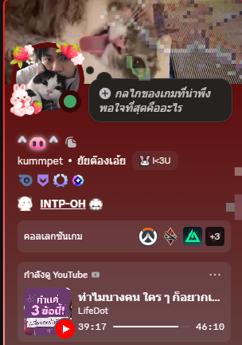
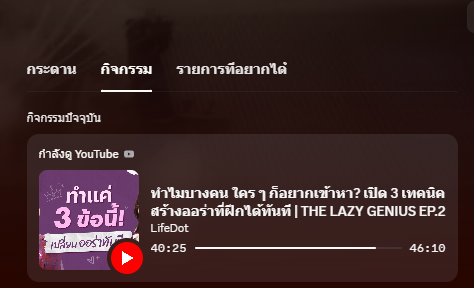

# Discord Rich Presence — Antigravity Edition v2

โชว์เพลง/คลิปที่กำลังเล่น (YouTube, YouTube Music, Spotify) และงานที่ทำอยู่ (VS Code) บนโปรไฟล์ Discord
สวยเหมือน integration ทางการ • กินเครื่องน้อยมาก • หลบเกมให้เอง • **ใช้ได้ทุกเครื่อง Windows 10/11**

<div align="center">

| 1. การ์ดโปรไฟล์ Discord เต็มรูปแบบ | 2. การ์ดกิจกรรมขณะเล่นคลิป (หลอดเวลา & ปกจริง) |
| :---: | :---: |
|  |  |

<p align="center">
  <i>🔥 ซิงค์รูปหน้าปกคลิป YouTube จริง • หลอดเวลา Sub-second Precision • สเตตัสเรียลไทม์ตรงกับคลิปเป๊ะๆ</i>
</p>

</div>

---

## สำหรับผู้ใช้ทั่วไป (ไม่ต้องรู้เรื่องโปรแกรม) — 3 ขั้นตอน

**วิธีที่ 1: ไฟล์ .exe สำเร็จรูป (ง่ายสุด)**

1. ดาวน์โหลด `DiscordRichPresence-windows.zip` จากหน้า **Releases** ของโปรเจกต์ → แตกไฟล์ไว้โฟลเดอร์ไหนก็ได้
2. เปิด Discord ให้เรียบร้อย แล้วดับเบิลคลิก **`DiscordRichPresence.exe`**
3. จะมี**ไอคอนสีม่วง** โผล่ที่ tray มุมล่างขวา (ข้างนาฬิกา) = ทำงานอยู่ — เท่านี้จบ

> Windows อาจขึ้นเตือน "Windows protected your PC" เพราะไฟล์ยังไม่ได้ซื้อใบรับรอง (code-signing) ให้กด **More info → Run anyway** • ไฟล์ทั้งหมด build โดย GitHub Actions จากโค้ดในโปรเจกต์นี้ ตรวจสอบได้ในแท็บ Actions

**วิธีที่ 2: จากโค้ด (ถ้าโหลด exe ไม่ได้ หรืออยากแก้เอง)**

1. ดาวน์โหลดโค้ด (Code → Download ZIP) แล้วแตกไฟล์
2. ดับเบิลคลิก **`start.bat`** — มันจะตรวจเองว่ามี Python ไหม
   - ถ้าไม่มี จะเปิดหน้าดาวน์โหลด Python ให้ → ติดตั้งโดย **ติ๊ก "Add python.exe to PATH"** → รัน `start.bat` ใหม่
   - รอบแรกจะติดตั้งไลบรารีเอง 1–2 นาที (ครั้งเดียว)
3. ครั้งต่อ ๆ ไปใช้ **`start_background.vbs`** เพื่อรันเงียบ ๆ ไม่มีหน้าต่างดำ

---

## ไอคอน tray ทำอะไรได้บ้าง (คลิกขวาที่ไอคอน)

| เมนู | ทำอะไร |
|---|---|
| สถานะ: … | บอกว่าตอนนี้โชว์อะไร / รอ Discord / ซ่อนเพราะเล่นเกม |
| ⏸ หยุดแสดงสถานะ / ▶ เริ่ม | ปิด-เปิดชั่วคราวโดยไม่ต้องออกโปรแกรม (ไอคอนเปลี่ยนเป็นสีเทาตอนหยุด) |
| แก้ไข config.json | เปิดไฟล์ตั้งค่า — แก้แล้ว**มีผลทันที** ไม่ต้องรีสตาร์ท |
| เปิดไฟล์ log | ดูว่าเกิดอะไรขึ้น (ใช้ตอนแจ้งปัญหา) |
| ออกจากโปรแกรม | ปิดและ**ลบสถานะออกจากโปรไฟล์**ให้เรียบร้อย |

ให้รันเองตอนเปิดเครื่อง: ดับเบิลคลิก `autostart_on.bat` (ยกเลิก `autostart_off.bat`) — สำหรับ .exe ให้สร้าง shortcut ของ exe ไปวางใน `shell:startup`

---

## ถ้าไม่ขึ้นสถานะ — เช็คตามนี้ (เรียงจากพบบ่อยสุด)

| อาการ | สาเหตุ / วิธีแก้ |
|---|---|
| ไม่ขึ้นอะไรเลย | Discord → **Settings → Activity Privacy** → เปิด *Share your detected activities with others* |
| ยังไม่ขึ้น | ต้องเป็น **Discord Desktop** (เว็บ/มือถือใช้ไม่ได้) และเปิด Discord ก่อนโปรแกรม (ถ้าเปิดทีหลัง โปรแกรมจะต่อเองภายใน 10 วิ) |
| ขึ้นแต่ไม่มีเพลง/คลิป | เปิดคลิปให้**เล่นอยู่จริง** • ใน Chrome/Edge ต้องเห็นปุ่มควบคุมเพลงที่ปุ่มปรับเสียง Windows (Media Overlay) ถ้าไม่เห็น ให้เปิด `chrome://flags/#hardware-media-key-handling` = Enabled |
| ปกคลิปไม่ขึ้น (เป็นโลโก้แดง) | รอ 5–10 วิ (กำลังหา video id) • ถ้ายังไม่ขึ้น = ค้นหาไม่พบ/เน็ตมีปัญหา จะลองใหม่เองทุก 2 นาที |
| ตัวเองไม่เห็นปุ่มบนการ์ด | ปกติครับ Discord **ซ่อนปุ่มของตัวเอง** แต่เพื่อนเห็น |
| หัวการ์ดเป็น "กำลังเล่น" ไม่ใช่ "กำลังฟัง" | Discord รุ่นเก่า — อัปเดต Discord |
| start.bat ปิดตัวเองทันที | เปิด `rpc.log` ในโฟลเดอร์ดูข้อความ error แล้วส่งมาถาม |
| Antivirus เตือน exe | เป็น false-positive ของ PyInstaller ที่พบบ่อย — ใช้วิธีที่ 2 (รันจากโค้ด) แทนได้ |

---

## ตั้งค่า `config.json`

```jsonc
{
  "client_id": "1546386469353160804",   // ใช้ค่านี้ได้เลย ไม่ต้องสร้างแอปเอง (ชื่อการ์ดถูก override แล้ว)
  "language": "th",                    // "th" หรือ "en"
  "update_interval_seconds": 5,        // ความถี่ตรวจ (ส่งให้ Discord เฉพาะตอนเปลี่ยนจริง)
  "gaming_interval_seconds": 15,       // ความถี่ตอนเล่นเกม
  "show_cover_art": true,              // false = โชว์โลโก้แทนปกคลิป
  "pause_when_gaming": true,           // เกมเต็มจอ -> ซ่อนสถานะให้ Discord โชว์เกมแทน
  "game_processes": ["valorant.exe"],  // เกมที่ให้ซ่อนทันทีที่เปิด แม้ไม่เต็มจอ (ไม่บังคับ)
  "custom_button": { "label": "⚡ Antigravity AI", "url": "https://github.com" },  // ปุ่มที่ 2 ของคุณ
  "buttons": [ { "label": "📺 Open YouTube", "url": "https://www.youtube.com" } ]  // ปุ่มตอนไม่ได้เล่นสื่อ
}
```

**อยากใช้แอป Discord ของตัวเอง (ไม่บังคับ):** [Developer Portal](https://discord.com/developers/applications) → New Application → copy **Application ID** มาใส่ `client_id` → อัปโหลด App Icon ได้ตามใจ (ไม่ต้อง invite bot / ไม่ต้องกด Install)

---

## หน้าตาการ์ด: เดิม vs v2

| ส่วน | เดิม | v2 |
|---|---|---|
| หัวการ์ด | `กำลังดู Bio` | `กำลังดู YouTube` / `กำลังฟัง YouTube Music` / `กำลังฟัง Spotify` |
| ปก | `hqdefault` 4:3 **มีแถบดำ** | `maxresdefault` 1280×720 ตรวจว่ามีจริง → ถอยไป `mqdefault` (16:9) |
| ชื่อคลิป / ปก / ชื่อช่อง | ข้อความเฉย ๆ | **คลิกได้** → เปิดคลิป / เปิดช่อง |
| ใน member list | ชื่อแอป | ชื่อเพลงเลย |
| หลอดเวลา | อัปเดตแล้วกระตุก | anchor กับ `last_updated_time` ตรงเสี้ยววินาที |
| กด pause | หลุดสถานะ | `⏸ หยุดชั่วคราว 06:57 / 14:28 • EYETA` |
| ชื่อรก `(Official MV) [4K]` | โชว์หมด | ตัดออก แต่ไม่แตะวงเล็บที่เป็นชื่อจริง เช่น `(ไม่เปลือง)` |
| เล่นเกม | โชว์ทับ | ซ่อนอัตโนมัติ กลับมาเองเมื่อออกเกม |

---

## ประสิทธิภาพ (ตอบเรื่อง "กินสเปคไหม")

ไม่กระทบ FPS ทั้งเวอร์ชันเก่าและใหม่ (RAM ~40 MB) แต่ v2 ทำงานน้อยลง ~10 เท่า: ส่งให้ Discord เฉพาะตอนเปลี่ยน, งานเน็ตอยู่ thread แยกไม่ค้าง, สร้าง Windows Media API ครั้งเดียว, สแกนโปรเซส cache 10 วิ, ตั้งตัวเองเป็น **Below-Normal priority + Efficiency mode** ให้ Windows จัดคิวหลังเกมเสมอ

ความเสี่ยงที่ควรรู้: โปรแกรมอ่านรายชื่อโปรเซส/ชื่อหน้าต่างเหมือนที่ Discord เองทำ โอกาสโดน anti-cheat มองผิดต่ำมาก แต่ถ้ากังวลกับเกม anti-cheat เข้ม (Vanguard/FACEIT) ใส่ชื่อ exe ใน `game_processes` จะซ่อนทันทีที่เกมเปิด

---

## สำหรับนักพัฒนา

```
main.py               โปรแกรมทั้งหมด (ไฟล์เดียว)
├─ Config             อ่าน config.json ใหม่เฉพาะตอนไฟล์เปลี่ยน / สร้างให้ถ้าไม่มี
├─ YouTubeResolver    thread แยก: video id, ช่อง, ปก maxres→mq (LRU 200 + ผลลบ TTL 2 นาที)
├─ WindowsProbe       media (winrt หรือ winsdk), process/window snapshot, fullscreen game, priority
├─ build_payload()    pure function → ทดสอบได้โดยไม่ต้องมี Windows/Discord
├─ should_send()      dedupe: เนื้อหาเปลี่ยน / seek >3 วิ / heartbeat 15 นาที
├─ Controller + run() main loop ควบคุมจาก tray (pause/quit) ปิดแล้ว clear presence
└─ run_with_tray()    pystray (ถ้าไม่มี = รันเงียบ) — ปิด tray ด้วย --no-tray
tests/test_logic.py   python tests/test_logic.py
build_exe.bat         build .exe บนเครื่องตัวเอง (PyInstaller)
.github/workflows/    push tag v* → build exe + สร้าง Release อัตโนมัติ
```

รองรับ Python **3.10–3.13+** (ใช้ `winrt-*` เป็นหลัก ถ้า ≤3.12 จะติดตั้ง `winsdk` เผื่อด้วย) • `.venv` ไม่ถูก commit และ `start.bat` ตรวจว่า venv ใช้ได้จริงก่อนรัน (venv ที่ copy จากเครื่องอื่นจะถูกสร้างใหม่เอง)

**สิ่งที่ยังไม่ได้ทดสอบบนเครื่องจริง** (พัฒนาจาก Linux sandbox): Discord IPC, GSMTC ผ่าน `winrt`, tray icon, และ PyInstaller build — logic ทั้งหมดผ่านชุดทดสอบแล้ว ถ้ารันแล้วเจอปัญหา ส่ง `rpc.log` มาได้เลย

ปล่อยเวอร์ชันใหม่: `git tag v2.0.0 && git push --tags` → รอ Actions เสร็จ → มี zip ในหน้า Releases
