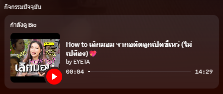
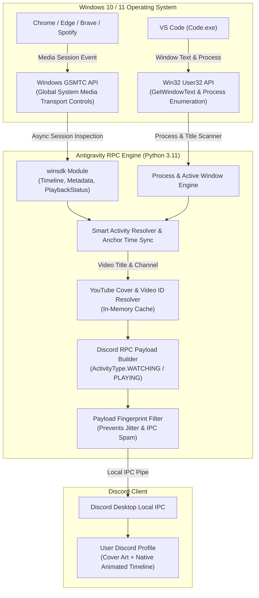

# ⚡ Antigravity Discord Rich Presence (Senior Pro Edition)

<div align="center">


**ระบบแสดงสถานะ Discord Rich Presence อัจฉริยะระดับ Enterprise**  
*ดึงข้อมูลการดู YouTube (หน้าปกคลิปจริง + หลอดเวลาเรียลไทม์), การเขียนโค้ดบน VS Code และ AI Pair Programming ขึ้นบนโปรไฟล์ Discord ของคุณแบบสมจริงระดับ Official Integration*

</div>

---

## 📸 ภาพตัวอย่างการทำงานจริง (Live Demonstration)

<div align="center">

| 1. คลิปที่เปิดดูบน YouTube จริง | 2. สถานะบนโปรไฟล์ Discord ที่ซิงค์อัตโนมัติ |
| :---: | :---: |
|  |  |

<p align="center">
  <i>🔥 ดึงหน้าปกคลิปจริง (Thumbnail HQ) • ชื่อคลิปและช่องจริง • หลอดความคืบหน้า Progress Bar แบบ Sub-second</i>
</p>

</div>

---

## 🌟 ฟีเจอร์เด่น (Key Architectural Features)

### 1. ⏱️ ระบบคำนวณเวลาแบบ Anchor Timestamp (Sub-Second Precision)
- **แก้ปัญหาเวลารีเซ็ต**: ไม่ส่งคำสั่งอัปเดตเวลาหลอกทุกๆ ไม่กี่วินาทีเหมือนสคริปต์ทั่วไป
- **คำนวณด้วย Anchor Algorithm**: ผูกค่าเวลาที่แท้จริงจาก Windows Media Control (`last_updated_time - position`) ส่งค่า `start_ts` และ `end_ts` เพียงครั้งเดียว ให้ Discord Client เป็นผู้เรนเดอร์หลอดความคืบหน้า (Progress Bar) อย่างราบรื่น
- **รองรับสถานะ Play / Pause**: เมื่อกดหยุดคลิป จะแสดงเวลาที่หยุดค้างไว้ `[06:57 / 14:28]` โดยไม่ทำให้ตัวจับเวลาเดินเตลิด

### 2. 🖼️ Realtime YouTube Thumbnail & Direct Video Resolver
- **ดึงหน้าปกคลิปจริง**: แปลงชื่อคลิปและช่องที่กำลังเล่น ค้นหา Video ID เพื่อดึงรูปหน้าปกความละเอียดสูง `https://i.ytimg.com/vi/<id>/hqdefault.jpg` มาแสดงผลแทนโลโก้ธรรมดา
- **ปุ่มเปิดคลิปโดยตรง**: ปุ่ม `[ ▶ ดูคลิปนี้บน YouTube ]` จะผูกเข้ากับ Direct Video URL (`https://www.youtube.com/watch?v=...`) ให้เพื่อนใน Discord กดเข้าไปดูคลิปเดียวกันได้ทันที
- **In-Memory Caching (LRU)**: เก็บแคช Video ID และรูปภาพไว้ในหน่วยความจำ ลดการเรียกเครือข่ายซ้ำซ้อน 99%

### 3. 💻 Multi-Tasking Mode (Coding + Media Playback)
- ตรวจจับทั้งการเขียนโค้ดใน **Visual Studio Code** และการฟังเพลง/ดูคลิปไปพร้อมกัน
- แสดงผลแบบไฮบริด: โชว์ทั้งไฟล์/Workspace ที่กำลังแก้ และชื่อเพลงที่กำลังฟังคลออยู่เบื้องหลัง

### 4. 🛡️ Fingerprint-Based IPC Dispatch (Zero Jitter)
- ตรวจสอบความเปลี่ยนแปลงของสถานะด้วย Payload Fingerprint
- ป้องกันการยิงคำสั่งซ้ำซ้อนไปยัง Discord IPC Gateway ลดอัตราการเกิด Rate-Limit และอาการกระตุกของ Discord UI

---

## 🏗️ สถาปัตยกรรมการทำงาน (System Architecture)



---

## 📂 โครงสร้างโปรเจกต์ (Project Structure)

```text
clever-davinci/
│
├── .venv/                      # Isolated Virtual Environment (Python 3.11+)
├── main.py                     # Senior-Grade Discord RPC Engine (GSMTC + IPC)
├── config.json                 # Core Configuration (Client ID, Defaults, Buttons)
├── start.bat                   # One-Click Interactive Console Launcher
├── start_background.vbs        # Silent Background Launcher (No Console Window)
├── stop_background.bat         # One-Click Process Killer for Background Mode
├── requirements.txt            # Pinned Dependencies (pypresence, psutil, winsdk)
└── README.md                   # Enterprise Documentation & Developer Guide
```

---

## 🚀 วิธีติดตั้งและเปิดใช้งาน (Quickstart Guide)

### 1. ข้อกำหนดเบื้องต้น (Prerequisites)
- **ระบบปฏิบัติการ**: Windows 10 หรือ Windows 11 (รองรับ GSMTC API เต็มรูปแบบ)
- **โปรแกรม Discord**: ติดตั้ง Discord Desktop บนคอมพิวเตอร์และเข้าสู่ระบบเรียบร้อย
- **Python**: เวอร์ชัน 3.10 ขึ้นไป

### 2. การตั้งค่าในโปรแกรม Discord (สำคัญมาก ⭐)
1. เปิด Discord ไปที่ **User Settings (ไอคอนฟันเฟือง)** มุมซ้ายล่าง
2. เลือกหมวด **Activity Privacy (ความเป็นส่วนตัวของกิจกรรม)**
3. เปิดสวิตช์:
   - ✅ **"Display current activity as a status message"** (แสดงกิจกรรมปัจจุบันเป็นข้อความสถานะ)

### 3. รันโปรแกรม (เลือกได้ 2 วิธี)
- **วิธีที่ 1 (หน้าต่างคอนโซลมีสถานะบอก)**:
  ดับเบิ้ลคลิกไฟล์ `start.bat`
- **วิธีที่ 2 (รันเงียบๆ ซ่อนหน้าต่างสีดำในพื้นหลัง)**:
  ดับเบิ้ลคลิกไฟล์ `start_background.vbs`  
  *(หากต้องการปิด ให้ดับเบิ้ลคลิก `stop_background.bat`)*

---

## 🎨 การปรับแต่งชื่อแอปให้สมบูรณ์แบบ (Discord Developer Portal)

เพื่อให้ชื่อหัวข้อใหญ่บนสุดขึ้นว่า **"กำลังดู YouTube"** หรือ **"กำลังเล่น Visual Studio Code"** อย่างสมจริง:

1. เข้าไปที่ [Discord Developer Portal](https://discord.com/developers/applications)
2. เลือก Application ของคุณ (`1546386469353160804`)
3. ไปที่แท็บ **General Information** ทางซ้ายมือ
4. แก้ไขช่อง **NAME** เช่น:
   - ตั้งเป็น `YouTube` (จะแสดงผลว่า: **"กำลังดู YouTube"**)
   - หรือ `YouTube Music`
   - หรือ `Visual Studio Code`
   - หรือ `Workspace & Chill`
5. กดปุ่มสีเขียว **Save Changes** ด้านล่างสุด

---

## ⚙️ การตั้งค่า `config.json`

```json
{
  "client_id": "1546386469353160804",
  "update_interval_seconds": 2,
  "buttons": [
    {
      "label": "📺 Open YouTube",
      "url": "https://www.youtube.com"
    },
    {
      "label": "⚡ Antigravity AI",
      "url": "https://github.com"
    }
  ]
}
```

---

## 🔬 ทำไมถึงใช้ Windows GSMTC แทนการใช้ Extension?

| คุณสมบัติ | ระบบ Windows GSMTC (สคริปต์นี้) | ระบบที่ต้องพึ่งพา Browser Extension |
| :--- | :--- | :--- |
| **การใช้ทรัพยากร** | ⚡ กินแรมน้อยมาก ดึงข้อมูลผ่าน OS API ตรงๆ | ❌ ต้องรัน Background Script ตลอดเวลาบนเบราว์เซอร์ |
| **ความเข้ากันได้** | 🌐 รองรับทั้ง Chrome, Edge, Brave, Spotify, Opera | ❌ ต้องติดตั้งและตั้งค่าแยกทุกเบราว์เซอร์ |
| **ความปลอดภัย** | 🔒 ปลอดภัย 100% ไม่ดึง Cookies หรือประวัติการท่องเว็บ | ⚠️ Extension มักขอสิทธิ์ Read/Change Data All Websites |
| **การติดตั้ง** | 🚀 รันไฟล์เดียวจบ ไม่ต้องกดติดตั้งอะไรในเบราว์เซอร์ | ❌ ต้องดาวน์โหลดและกดยืนยันสิทธิ์ใน Web Store |

---

## 📄 ใบอนุญาต (License)

โปรเจกต์นี้เผยแพร่ภายใต้สัญญาอนุญาต [MIT License](LICENSE) สามารถนำไปพัฒนาต่อยอด ปรับแต่ง หรือใช้งานได้อย่างอิสระครับ
